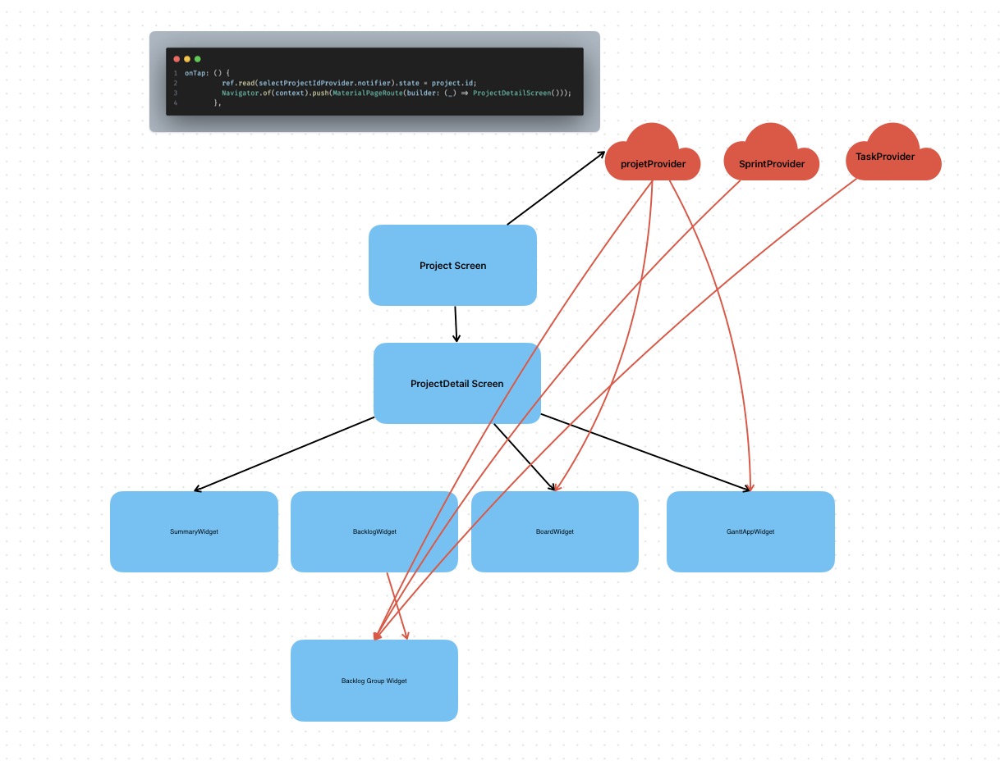

# 📅 Day 37 ของการฝึกงาน
**วันที่:** 8 สิงหาคม 2025  
**สถานที่ฝึกงาน:** บริษัท TECH CARE SOLUTION Co.Ltd,  
**ตำแหน่ง:** นักพัฒนาซอฟต์แวร์ฝึกหัด (Junior Front-End Developer)

# การเข้าถึงและจัดการข้อมูล Riverpod Vs Tree



# อธิบายการใช้ Riverpod Vs Tree

```dart
onTap: () {
          ref.read(selectProjectIdProvider.notifier).state = project.id;
          Navigator.of(context).push(MaterialPageRoute(builder: (_) => ProjectDetailScreen()));
        },
```

# โครงสร้างของ UI Widget Tree
```
- Project Screen เป็นหน้าจอหลักที่แสดงรายการโปรเจกต์
เมื่อมีการแตะ onTap ที่โปรเจกต์ใดโปรเจกต์หนึ่ง จะมีการเรียกใช้โค้ดด้านบนที่ใช้ Riverpod เพื่อเปลี่ยนสถานะ state ของ ProjectProvider และนำทาง navigate ไปยังหน้าจอ ProjectDetailScreen
- ProjectDetailScreen เป็นหน้าจอที่แสดงรายละเอียดของโปรเจกต์นั้น ซึ่งประกอบไปด้วย Widget ย่อย ๆ หลายตัว ได้แก่ SummaryWidget, BacklogWidget, BoardWidget, และ GanttAppWidget
- BacklogWidget ยังมี Widget ย่อยลงไปอีกคือ Backlog Group Widget
```

# การเข้าถึงและจัดการข้อมูล Riverpod
```
- ภาพแสดงให้เห็นว่า ProjectDetailScreen และ Widget ย่อย ๆ หลายตัว สามารถเข้าถึงและใช้งานข้อมูลจาก Provider ต่าง ๆ ได้โดยตรง เช่น ProjectProvider, SprintProvider, และ TaskProvider
- ลูกศรสีแดงที่พุ่งตรงจาก Provider ไปยัง Widget ต่าง ๆ เช่น ProjectDetailScreen, BacklogWidget, BoardWidget และ Backlog Group Widget บ่งบอกว่า Widget เหล่านี้สามารถ "ฟัง" listen หรือ "อ่าน" read ข้อมูลจาก Provider ได้โดยตรง โดยไม่ต้องพึ่งพาการส่งข้อมูลผ่าน Widget Tree แบบ InheritedWidget หรือ Provider
- การออกแบบเช่นนี้เป็นจุดเด่นของ Riverpod ที่ช่วยให้การจัดการข้อมูลมีความยืดหยุ่นและลดความซับซ้อนของการส่งข้อมูลแบบลำดับชั้นลงได้มาก
```

# ข้อแตกต่าง

```
Riverpod 
เป็นแพ็กเกจจัดการสถานะที่ปลอดภัยและยืดหยุ่นกว่า ถูกออกแบบมาเพื่อแก้ไขข้อบกพร่องของแพ็กเกจเดิมอย่าง Provider มันไม่ขึ้นอยู่กับโครงสร้างของ Widget Tree ทำให้สามารถเข้าถึงข้อมูลจากที่ไหนก็ได้ในแอปพลิเคชันอย่างปลอดภัย โดยไม่ต้องกังวลว่าจะเกิดข้อผิดพลาด นอกจากนี้ยังทำให้การทดสอบ ทำได้ง่ายขึ้นเพราะ Logic ถูกแยกออกจาก UI อย่างชัดเจน

Tree
การจัดการข้อมูลแบบ Tree เช่น InheritedWidget หรือ Provider อาศัยโครงสร้างของ Widget Tree เป็นหลัก ข้อมูลจะถูกส่งต่อจาก Widget แม่ไปสู่ Widget ลูกเท่านั้น การเข้าถึงข้อมูลจึงต้องทำจาก Widget ที่อยู่ใต้ Widget ที่ถือข้อมูลนั้น ซึ่งหากเข้าถึงผิดตำแหน่งอาจทำให้เกิดข้อผิดพลาดได้ง่าย แม้จะเข้าใจได้ง่ายในแง่ของแนวคิด แต่ก็มีความยืดหยุ่นน้อยกว่า

```

# สรุป

Riverpod เหมาะสำหรับโปรเจกต์ขนาดใหญ่และซับซ้อนที่ต้องการความปลอดภัยสูง การทดสอบที่ง่าย และโครงสร้างที่ยืดหยุ่น

Tree เหมาะสำหรับโปรเจกต์ขนาดเล็กหรือผู้เริ่มต้นที่ต้องการความเรียบง่ายและ
เข้าใจแนวคิดการส่งต่อข้อมูลตามโครงสร้างของ Widget Tree ได้ง่ายขึ้น